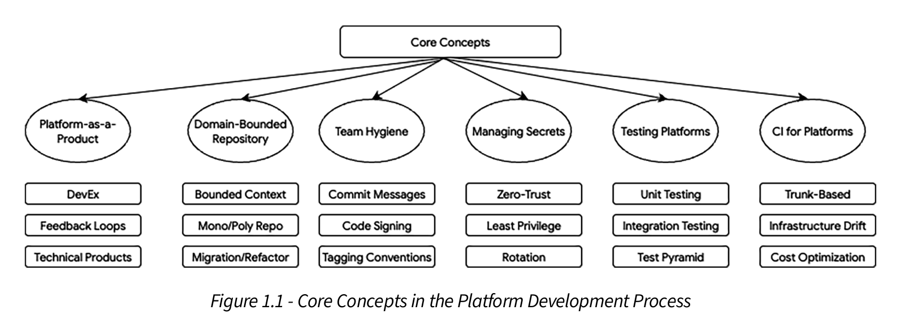
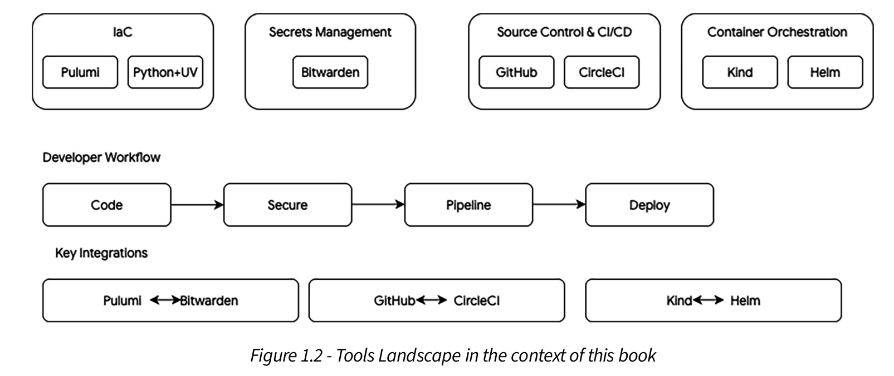

# Chapter 1: Laying the Groundwork

<br/>

### Core Design Principles



<br/>

### The Tool Stack



<br/>

### Environment Setup

<br/>

https://vault.bitwarden.com/#/settings/security/security-keys

<br/>

1. Copy `.env_example` to `.env` and fill in your Bitwarden credentials:

<br/>

```bash
$ cp .env_example .env
```

<br/>

2. Set the following environment variables in `.env`:

   - `BW_CLIENTID`: Bitwarden API Client ID
   - `BW_CLIENTSECRET`: Bitwarden API Client Secret
   - `BW_PASSWORD`: Bitwarden Master Password

<br/>

3. Upload your book secrets to Bitwarden (run once):

<br/>

```bash
$ cd secrets-setup
$ chmod +x inject_secrets.sh
$ ./inject_secrets.sh
```

<br/>

4. Set Pulumi config values for the GitHub provider:

<br/>

```bash
$ pulumi config set github:token  ghp_your_token_here --secret
$ pulumi config set github:owner  your-github-org
```

<br/>

5. Edit `config/platform_team_values.yaml` to define your repositories and team members, then apply:

<br/>

```bash
$ pulumi preview    # dry-run first
$ pulumi up         # apply
```

---

<br/>

## Step-by-Step Instructions

Follow this execution order to work through the Chapter 1 concepts:

<br/>

### Step 1: Understand Platform Maturity (5-10 minutes)

Run the platform maturity assessment to evaluate where your organization stands:

```bash
$ python platform-maturity-assessment.py
```

**What it does:**

- Interactively asks 20 questions across four dimensions:
  - Self-Service Capabilities
  - Observability
  - Security & Compliance
  - Developer Experience
- Calculates maturity scores (1-5 scale) for each dimension
- Generates a comprehensive report with strengths and improvement areas
- Exports results to `assessment_results.json`

**Expected Output:**

```
======================================================================
PLATFORM MATURITY ASSESSMENT
======================================================================

[Assessment questions for each dimension...]

======================================================================
ASSESSMENT REPORT
======================================================================

Dimension Scores:
  Self-Service Capabilities: 4.2/5.0 (HIGH)
  ...

Overall Platform Maturity Score: 3.8/5.0
```

**Next Step:** Review the results to identify baseline maturity across dimensions.

---

<br/>

### Step 2: Customize Platform Configuration (15-20 minutes)

Edit `platform-config.yaml` to match your organization:

```bash
# Review the current configuration
$ cat platform-config.yaml

# Edit with your favorite editor (vi, nano, vscode, etc.)
$ vi platform-config.yaml
```

**Key sections to customize:**

1. **Platform Identity** (lines 1-10):

   - Update `platform.name` and `platform.owner-team`
   - Change `version` if needed

2. **Platform Principles** (lines 12-50):

   - Keep the six core principles (Self-Service, Guardrails, etc.)
   - Update `description` and `measurable` fields to reflect your goals

3. **Team Structure** (lines 52-80):

   - Modify the `teams` section with your actual team names and sizes
   - Add or remove team members as appropriate

4. **Golden Paths** (lines 81-130):

   - Define recommended technology stacks for your organization
   - Add deployment patterns and best practices

5. **Security Policies** (lines 131-160):
   - Configure compliance requirements (SOC2, ISO 27001, HIPAA, etc.)
   - Set security scanning and secret management requirements

**Example modification:**

```yaml
platform:
  name: 'Acme Corp Developer Platform'
  owner-team: 'DevEx Engineering'
  # ... rest of config
```

**Next Step:** Validate your configuration against design principles (Step 3).

---

<br/>

### Step 3: Validate Design Principles (5 minutes)

Check that your platform configuration adheres to core design principles:

```bash
$ python design-principles-checklist.py platform-config.yaml
```

**What it does:**

- Validates all six design principles:
  - Self-Service: Can teams self-serve without bottlenecks?
  - Guardrails: Are safe boundaries in place?
  - Golden Paths: Are recommended patterns clear?
  - Extensibility: Can the platform be extended?
  - Observability: Can platform health be monitored?
  - Security: Are security practices enforced?
- Checks configuration completeness
- Identifies gaps and improvement areas

**Expected Output:**

```
======================================================================
DESIGN PRINCIPLES VALIDATION REPORT
======================================================================

PRINCIPLE: Self-Service Capabilities
  ✓ Internal developer portal defined
  ✓ 5 self-service templates available
  ✓ High automation level
  ...

PRINCIPLE: Security & Compliance
  ✗ Security scanning not configured
  ⚠ Compliance requirements incomplete
  ...

Summary: 5/6 principles fully compliant
```

**Next Step:** Address any failed checks by updating `platform-config.yaml`.

---

<br/>

### Step 4: Run Configuration Tests (5 minutes)

Execute the unit tests to ensure configuration validity:

```bash
# Using pytest (recommended)
$ python -m pytest test-platform-config.py -v

# Or run directly
$ python test-platform-config.py
```

**What it tests:**

- YAML syntax and structure validation
- Required configuration sections present
- Configuration completeness checks
- Data type validation
- Platform principles requirements
- Team structure requirements

**Expected Output:**

```
test-platform-config.py::test_config_structure PASSED
test-platform-config.py::test_platform_principles PASSED
test-platform-config.py::test_team_structure PASSED
test-platform-config.py::test_golden_paths PASSED
test-platform-config.py::test_security_policies PASSED

=========== 5 passed in 0.23s ===========
```

**Next Step:** Generate team topology visualization (Step 5).

---

<br/>

### Step 5: Visualize Team Topology (5 minutes)

Generate a markdown visualization of your team structure:

```bash
$ python team-topology-generator.py
```

**What it does:**

- Displays the platform team organization (roles and responsibilities)
- Shows stream-aligned teams and their relationship to the platform
- Illustrates interaction modes (collaboration, communication, facilitation)
- Generates ASCII/markdown team topology diagram

**Expected Output:**

```
================================================================================
                        TEAM TOPOLOGY VISUALIZATION
================================================================================

┌─────────────────────────────────────────────────────────────────────┐
│ PLATFORM TEAM (8 members)                                           │
│ Responsibilities:                                                   │
│   • Develop and maintain platform services                          │
│   • Define golden paths and standards                               │
│   • Operate infrastructure                                          │
│   • Support stream-aligned teams                                    │
│   • Drive platform adoption                                         │
├─────────────────────────────────────────────────────────────────────┤
│ Roles:                                                              │
│  • Platform Lead - Strategy & Roadmap                               │
│  • Backend Engineer (2) - Platform Services                         │
│  • DevOps Engineer (2) - Infrastructure & Deployment                │
│  • Security Engineer - Security & Compliance                        │
│  • Developer Advocate - Documentation & Support                     │
│  • Data Engineer - Observability & Analytics                        │
└─────────────────────────────────────────────────────────────────────┘

STREAM-ALIGNED TEAMS:
  • Payments Team (6 members): Payment Processing, Billing
  • User Management Team (5 members): Authentication, Authorization
  • Analytics Team (4 members): Analytics, Reporting
  • Notifications Team (3 members): Email, SMS, Push Notifications

INTERACTION MODES:
  • Collaboration: Platform and stream teams work together on shared problems
  • Communication: Asynchronous updates and information sharing
  • Facilitation: Platform team supports and enables stream team success
```

**Next Step:** Review and customize the generator for your actual teams.

---

<br/>

### Step 6: Set Up Git Hooks for Commit Standards (5 minutes)

Install Git hooks to enforce conventional commits across your team:

<br/>

```bash
# From repository root
$ bash scripts/install-githooks.sh
```

<br/>

**What it does:**

- Copies the `commit-msg` hook from `.git-hooks/` to `.git/hooks/`
- Makes the hook executable
- Validates commit messages against conventional commits format

**Expected Output:**

```
Successfully installed commit-msg hook
Git hooks installation complete
Commit messages will now be validated for conventional commits format
```

**Commit Format:**
The hook enforces the conventional commits format: `type(scope)?: message`

Valid types: `build`, `chore`, `ci`, `docs`, `feat`, `fix`, `perf`, `refactor`, `revert`, `style`, `test`

**Examples:**

```bash
$ git commit -m "feat(auth): add OAuth2 login support"      ✓ Valid
$ git commit -m "fix(database): resolve connection leak"    ✓ Valid
$ git commit -m "docs: update installation guide"           ✓ Valid
$ git commit -m "Updated something"                         ✗ Invalid
```

**Next Step:** Review release workflow configuration (Step 7).

---

<br/>

### Step 7: Review Release Workflow Pattern (10 minutes)

Examine the multi-stage release workflow that implements best practices:

```bash
# View the GitHub Actions workflow
$ cat release-workflow.yaml

# View the CircleCI infrastructure workflow
$ cat .circleci/config.yml
```

**GitHub Release Workflow (`release-workflow.yaml`):**

The workflow implements a robust six-stage release process:

1. **Build Stage**

   - Checks out code
   - Sets up Docker Buildx
   - Authenticates to container registry
   - Extracts metadata (tags, versions)
   - Builds and pushes Docker image

2. **Test Stage**

   - Sets up Python environment
   - Runs unit tests with coverage
   - Runs integration tests
   - Uploads coverage reports to Codecov

3. **Security Scan Stage**

   - Runs Trivy vulnerability scanner on filesystem
   - Performs SAST (Static Application Security Testing)
   - Uploads results to GitHub Security tab

4. **Deploy to Staging Stage**

   - Sets up kubectl for cluster access
   - Deploys to staging environment (Kubernetes or Helm)
   - Performs health checks on deployment
   - Runs smoke tests against staging

5. **Approval Gate Stage**

   - Manual approval required before production deployment
   - Provides change record for audit trail

6. **Deploy to Production Stage**
   - Sets up kubectl for cluster access
   - Deploys to production environment
   - Verifies production deployment
   - Creates release tag and release notes

**CircleCI Infrastructure Workflow (`.circleci/config.yml`):**

> **Why CircleCI here and GitHub Actions later?** This chapter uses CircleCI for infrastructure deployment pipelines (Pulumi preview/approve/apply). Chapter 8 switches to GitHub Actions for application CI/CD pipelines. This is intentional — a platform team should be CI-tool-agnostic. The patterns demonstrated (reusable workflows, approval gates, progressive delivery) translate across any CI/CD system. Think of CircleCI here as the _infrastructure track_ and GitHub Actions in Chapter 8 as the _application delivery track_. Many organizations run both in production.

Demonstrates infrastructure-as-code deployment with Pulumi:

- **Preview Stage**: Shows infrastructure changes without applying (runs on all pushes to main)
- **Approval Gate**: Requires manual approval (triggered by version tags)
- **Deploy Stage**: Applies infrastructure changes (runs only on approval)

**Integration with Your Repository:**

To use the GitHub workflow in your repository:

<br/>

```yaml
# In .github/workflows/your-workflow.yml
jobs:
  release:
    uses: ./.github/workflows/release-workflow.yaml
    with:
      service-name: my-service
      environment: production
    secrets:
      REGISTRY_USERNAME: ${{ secrets.REGISTRY_USERNAME }}
      REGISTRY_PASSWORD: ${{ secrets.REGISTRY_PASSWORD }}
```

**Next Step:** Set up secrets management (Step 8).

---

<br/>

### Step 8: Configure Secrets Management (10 minutes, optional)

Set up secure secrets storage using Bitwarden:

**Note:** This step requires Bitwarden CLI and valid credentials. It's optional but recommended for production use.

**Setup:**

1. **Configure environment variables:**

```bash
$ cp .env_example .env
# Edit .env with your Bitwarden credentials
$ vi .env
```

2. **Upload secrets to Bitwarden:**

```bash
$ bash scripts/upload-secrets.sh
```

**What the script does:**

- Loads credentials from `.env` file
- Authenticates with Bitwarden using API credentials
- Unlocks the vault using master password
- Creates or updates a "GitHub Secrets" item in Bitwarden
- Stores the GitHub personal access token securely
- Syncs vault with Bitwarden servers
- Locks the vault to invalidate the session

**Expected Output:**

```
Logging into Bitwarden using API credentials...
Unlocking Bitwarden vault...
Creating GitHub Secrets item in Bitwarden...
Syncing Bitwarden vault...
Locking Bitwarden vault...
Successfully uploaded secrets to Bitwarden
```

**Security Best Practices:**

- Keep `.env` file out of version control (already in `.gitignore`)
- Rotate Bitwarden API credentials regularly
- Use strong master passwords
- Enable two-factor authentication on Bitwarden account
- Audit Bitwarden access logs periodically

**Next Step:** Review the template secrets structure in `secrets-setup/github_secrets.json`.

---

<br/>

### Step 9: Review Outputs and Assessment Results (5 minutes)

After completing the above steps, review the generated outputs:

```bash
# View assessment results
$ cat assessment_results.json

# View generated team topology (from Step 5)
# Output displayed directly to terminal

# View design principles validation report (from Step 3)
# Output displayed directly to terminal
```

**Key Files Generated:**

- `assessment_results.json`: Platform maturity assessment scores
- Validation reports: Printed to stdout during script execution
- Team topology: Printed to stdout during script execution
