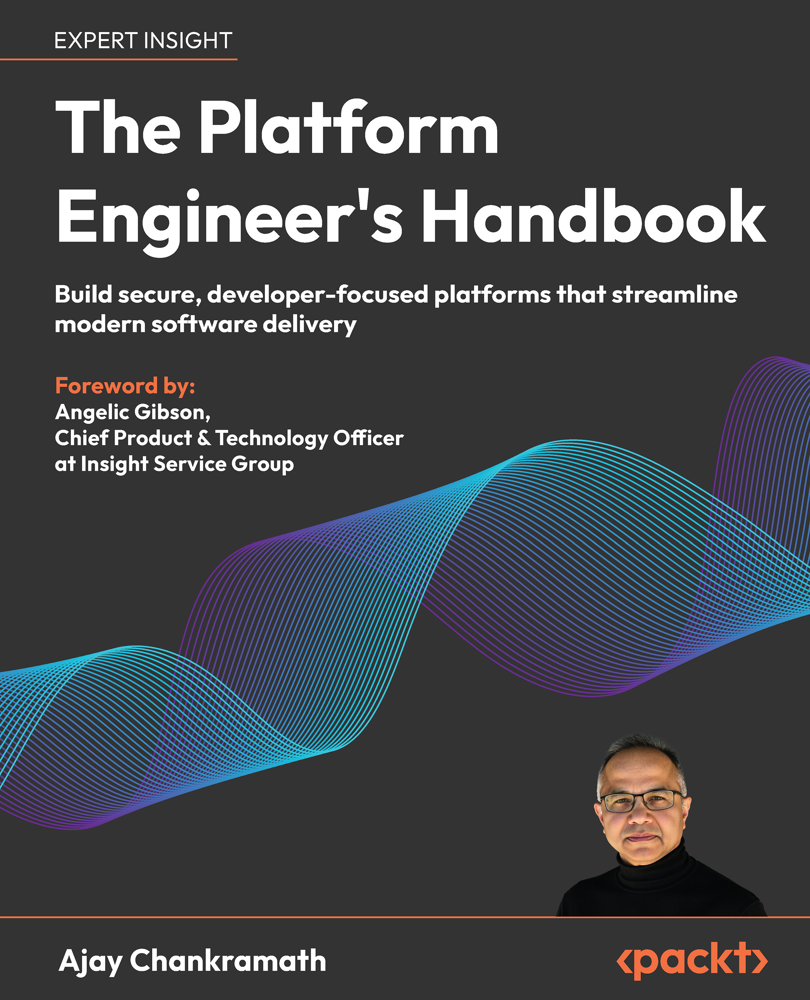

# [Book][Ajay Chankramath] The Platform Engineer's Handbook [ENG, 2026]

 

**Original repo:**  
https://github.com/achankra/peh

**Additional resources, videos, case studies, and interactive tools are available at:**  
https://peh-packt.platformetrics.com/

 

## Part 1: Designing, Building, and Deploying the Core Engineering Platform

### Chapter 1: Platform Engineering: Laying the Groundwork

https://www.youtube.com/watch?v=4_xMX8Jom6o

* Core Design Principles
* A Brief Discussion on the Tool Stack: Why these tools?
* Source Repository Topology
* Ensuring Commit Conventions
* Branching and Release Tagging Strategy

### Chapter 2: Scalable Platform Runtime with Kubernetes and Service Mesh

* The logic behind using Kubernetes for platform runtime
* Creating the Platform Runtime Environments
* Non-Prod and Prod Environments
* Activate GitOps Services on the Platform
* The App of Apps Repository
* Enabling Platform Services and Extensions

### Chapter 3: Securing Platform Access

* Understanding platform security requirements
* Identity and Access Management with OAuth
* Implementing Role-Based Access Control (RBAC)
* Building the demo application experience
* Audit and compliance logging

### Chapter 4: Embedding Observability

* Value of End-to-End Observability
* Differentiating from monitoring
* Observability as a business enabler
* Observability -Driven Development (ODD)
* Gathering Metrics, Logs, and Traces
* Automatic Telemetry Ingestion
* Observability Personas
* Embedding Observability into CI/CD

### Chapter 5: Evaluate the User Experience

* Developer experience as the backbone of platforms
* Deploying as a user
* Application instrumentation for observability
* Exposing a public URL
* DevEx Diaries: First Impressions Matter

## Part 2: Enhancing Productivity Through Self-Service Functions

### Chapter 6: Accelerating DevEx: Deploying and Curating Your First Developer Portal

* Selecting and deploying a developer portal
* Selection Flow
* Role-based navigation and permissions
* Enabling portal capabilities and features
* Publishing deployed services to a service catalog
* Backstage developer portal vs.COTS alternatives

### Chapter 7: Self-Service Platform Onboarding

* Creating an onboarding API
* Sidebar: The onboarding opportunity
* RBAC, namespace, and quota automation
* Enable self-service team management
* Custom onboarding services vs.cloud-native workflow tools

### Chapter 8: CI/CD as a Platform Service

* Context of reusable CI/CD
* The platform CI/CD vision
* Architectural overview
* Pipeline playbooks
* Creating reusable pipeline tasks
* Building composite action
* Testing the composite action you just built
* Developing pipeline templates
* Calling reusable workflows from team repositories
* Progressive delivery and rollbacks

### Chapter 9: Self-service Infrastructure Management

* Why do we need self-service capabilities on the platform?
* Service Catalogs vs.Infrastructure-as-Code frameworks
* Infrastructure blueprints
* Designing composite resources
* Governance with guardrails and tagging
* Provisioning and lifecycle automation
* Enabling innovation beyond the platform

### Chapter 10: Publishing Starter Kits

* When do starter kits make sense?
* Template architecture review
* Why are we using Backstage scaffolder?
* Yeoman and CLI-based scaffolding
* Scaffolding with Backstage templates
* Template files
* The upgrade problem
* When things go wrong
* Publishing templates to the catalog
* Testing starter kit templates
* Creating a new service with a starter kit

## Part 3: Scaling, Maturing, and Evolving Your Platform

### Chapter 11: Validating Compliance and Policy as Code

* Deploying an Admission Controller
* Using Rego for writing policies
* Shift-Left Policy Testing
* Compliance Dashboards
* Building Grafana Dashboards

### Chapter 12: Optimize Cost, Performance, and Scalability

* FinOps observability
* Autoscaling strategies
* Cost Optimization in the CI/CD Pipeline

### Chapter 13: Resilience Automation

* Defining and publishing SLOs
* Implementing SLOs
* Automating backup and restore
* Chaos Engineering
* Disaster Recovery

### Chapter 14: Agentic and AI-Augmented platforms

* Implementing generative and predictive AI in developer workflows
* Use case 1: AI-powered CI/CD pipeline generation
* Use case 2: Incident triage bots
* Use case 3: RAG for platform documentation
* Patterns and antipatterns
* Designing Agentic systems
* Integrating AI with your ecosystem

### Chapter 15: Appendix A—Comprehensive Setup Guide for macOS, Linux, and Windows

* Setting Up Your Organization Toolset
* GitHub Account Setup
* CircleCI Setup
* Foundational Tools
* Chapter-Specific Installation Instructions
* Troubleshooting